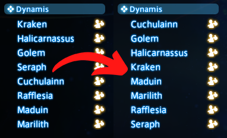
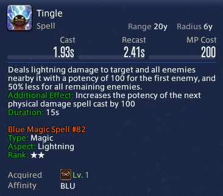
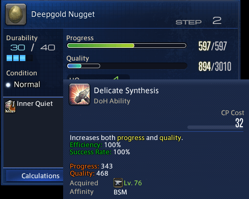
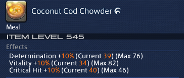
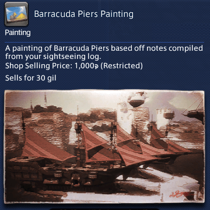

## Tweak List

---

### General Tweaks

---

- **Alt + F4 Exit Game**

  Pressing Alt + F4 will cause the game to close safely.

- **Auto Lock Action Bars**

  Automatically locks action bars when certain conditions are met.

- **Auto Refresh Material List**

  Automatically refreshes the raw material list and recipe tree windows.

- **Bait Command**

  Adds /bait to switch fishing baits.

- **Block Targeting Treasure Hunt Enemies**

  Disable targeting for enemies that are part of another players Treasure Hunt duty.

- **Character Directory Command**

  Adds a command to open the directory where client side character data is stored.

- **Character Window Job Switcher**

  Allow clicking on classes to switch to gearsets.

- **Clickable Alarm Icon**

  Allows clicking the alarm icon in the server bar to open the alarm window.

- **Combat Movement Type Control**

  Set movement type between Standard and Legacy when in/out of combat or when weapon is drawn/sheathed.

- **Command Alias**

  Allows replacing commands typed into chat box with other commands.

- **Customize default deposit and withdraw quantity**

  Allows setting a custom amount to deposit or withdraw when using the 'Retrieve Quantity' and 'Entrust Quantity' options.

- **Customize Group Pose Camera Control**

  Allows you to customize the camera control in group pose

- **Data Centre on Title Screen**

  Shows the current Data Centre on the Title Screen

- **Disable Camera Culling**

  Disable the hiding of characters when the camera gets too close.

- **Disable Click Targeting**

  Allows disabling of the target function on left and right mouse clicks.

- **Disable Mount Music Volume Change**

  Prevents mount music from going quiet when not moving.

- **Disable Mouse Camera Control**

  Disables all control of the camera using the mouse.

- **Disable Novice Network Auto-Switch**

  Disables automatically selecting novice network when logging in or transferring to another server.

- **Disable Title Screen Movie**

  Prevents the title screen from playing the introduction movie after 60 seconds.

- **Dismiss Minion Command**

  Adds a command to dismiss your current minion.

- **Duty Ready Class Switching**

  Click 'Previous' class icon in Duty Ready window to switch class.

- **Duty Timer**

  When completing a duty, tells you how much time the duty took.

- **Emote Log Status in Server Bar**

  Show the emote log status in the server bar.

- **Emote Log Subcommand**

  Adds a 'text' subcommand for emotes when emotelog is disabled.  /yes text

- **Ensure tooltips remain on screen**

  Prevents tooltips from extending below the bottom of the screen. Useful when using tweaks that make the tooltips longer.

- **Equip items from Hotbars**

  Enables the ability to equip items assigned to hotbars.

- **Equip Job Command**

  Adds a command to switch to a class or job's gearset.

- **Equip Recommended Command**

  Adds a command to equip recommended gear.

- **Estate Access Command**

  Adds a command to open the estate access configuration for the current estate.

- **Estate List Command**

  Adds a command to open the estate list of one of your friends.

- **Extended Macro Icons**

  Allow using specific Icon IDs when using '/macroicon # id' inside of a macro.

- **Fix '/target' command**

  Allows using the default '/target' command for targeting players or NPCs by their names.

- **Gearset Update Command**

  Updates the active gearset with your current equipment.

- **Hide 'Character not found' Message**

  Prevent the game from displaying the "The character you last logged out with could not be found on the current data center." message.

- **Hide Chat**

  Provides commands to hide the chat. (/chatvis show|hide|toggle)

- **Hide Hotbar Lock**

  Hides the hotbar lock button, with an option to make it visible while holding a modifier combo.

- **Hide Mouse Cursor After Inactivity**

  Hides the mouse cursor after a period of inactivity like video players do.

- **House Lights Command**

  Adds a command to control lighting in your own housing areas.

- **Improved Crafting Log**

  Modifies the Synthesize button in the Crafting Log to switch job or stand up from the crafting position, allowing you to stop crafting without closing the crafting log.

- **Improved Sent Message History**

  Recover messages after accidentally pressing up in the chat, and increase the amount of history retained.

- **Increase max line count in chat bubbles**

  Allow upto 7 lines of text to be displayed in chat bubbles.

- **Increased zoom on character previews**

  Allows zooming in near infinitely on character preview views, such as Try On and Examine.

- **Island Sanctuary Sprint Replacer**

  Replaces the normal Sprint action with Isle Sprint while in the Island Sanctuary.

- **Keep Windows Open**

  Prevents certain windows from hiding under specific circumstances.

- **Keyboard Gaming Mode**

  Block Alt-Tab and other keys to keep you in the game.

- **Leave Duty Command**

  Adds a command to leave the current duty.

- **Leveling Dungeon Command**

  Adds a command to open the highest level leveling dungeon available for your level.

- **Long Veil**

  Replaces the wedding veils with their long variants that are usually only shown in the sanctum of the twelve.

- **Main Command Command**

  Adds a command to allow using any Main Command from chat or macro.

- **No Sell List**

  Allows you to define a list of items that can not be sold to a vendor.

- **Open Adventurer Plate Command**

  Adds a command to open adventurer plates.

- **Open Commendation Window Automatically**

  Open the commendation window upon completion of a duty.

- **Open loot window when items are added**

  Open the loot rolling window when new items are added to be rolled on.

- **Phantom Job Command**

  Adds a command to switch phantom jobs within Occult Crescent

- **Quick Sell Items at Vendors**

  Hold a modifier key to sell items from your inventory in one click.

- **Refresh Market Prices**

  Retries to get prices upon receiving the 'Please wait and try your search again' message

- **Remember Quick Gathering**

  Remembers quick gathering status even after gathering at unspoiled nodes.

- **Remember Selected World**

  Remembers which world was selected for each datacentre.

- **Remove Client Limit**

  Allows opening more than the standard two FFXIV clients.

- **Reposition Cutscene Dialogue Box**

  Allows setting a custom position for dialogue boxes used in cutscenes.

- **Screenshot File Name**

  Change the file name format for screenshots.

- **Screenshot Improvements**

  Allows taking higher resolution screenshots, Hiding Dalamud & Game UIs and removing the copyright notice from screenshots.

- **Searchable Friend List**

  Adds a search bar to the friend list.

- **Set Option Command**

  Adds commands to change various settings.

- **Show process id Command**

  Adds a command to show the current process id.

- **Smart Strafe**

  Intelligently switches keyboard controls between strafing and turning.

  (Legacy type movement only)

- **Sort World Visit List**

  Removes the randomization from the data center visit world list.

  

- **Special Character Input**

  Adds a window for adding special characters to text inputs.

- **Squadron Chemistry Available Icon**

  Show an icon over squadron members who have a new chemistry available.

- **Sync Crafter Bars**

  Keeps DoH job bars in sync

- **Sync Gatherer Bars**

  Keeps miner and botanist hotbars in sync.

- **SystemConfig in Group Pose**

  Allows the use of the /systemconfig command while in gpose.

- **Talk Adjustments**

  Allows further customisation to the Talk addon.

- **Try On Correct Item**

  Show the correct item when trying on a glamoured item.

- **Use Collection Command**

  Adds a command to use Collection items. /usecollection

- **Use Custom Time for Furniture Clocks**

  Changes the time displayed on chronometer furniture.

### Chat Tweaks

---

- **Case Insensitive Text Commands**

  Allows text commands to be entered without caring about case.

- **Chat Name Colours**

  Gives players a random colour in chat, or set the name manually.

- **Chat Sounds Everywhere**

  Enables <se.#> chat sounds everywhere, regardless of channel.

- **Clickable Links in Chat**

  Parses links posted in chat and allows them to be clicked.

- **Custom Timestamp Format**

  Customize the timestamps displayed on chat messages.

- **Disable Auto Chat Inputs**

  Prevent the game from inserting <flag> or other parameters into chat box.

- **Disable Chat Movement**

  Prevents movement of the chat window.

- **Display EXP Gain Percentage of Level**

  Adds the percentage of your next level to exp gains in chat.

- **Echo Party Finder**

  Prints Party Finder description to chat when joining a group and entering a duty.

- **Echo Story Selection**

  When given multiple choices during quests, print the selected option to chat.

- **Hide Chat Automatically**

  Hides chat automatically except when typing.

- **Hide Chat Panel Buttons**

  Hide the chat log name and close button on panels that have been split from the main window.

- **Improved Chat Font Sizes**

  Allows you to change the font size for the chat windows beyond the default limits, and allows docked chat tabs to keep their font size separate from the main tab.

- **Print Search Comment**

  Prints the Search Comment of people, that get inspected, into the chat.

- **Rename Chat Tabs**

  Allows renaming the General and Battle tabs in the chat window.

- **Reply Channel Switch**

  Allow typing /r to set active chat channel to Tell.

- **Smart AutoScroll**

  Attempts to prevent autoscrolling when receiving new chat messages while scrolled up.

- **Sticky Chat**

  Sets the chat channel when you use temporary chat messages.

  Example: "/p hello!" will set the chat channel to Party

- **Sticky Shout Chat**

  Prevents the game from automatically switching out of shout chat.

- **Zoomed Chat Customization**

  Allows customization of the size and position of the zoomed chat view.

### TooltipTweaks

---

- **Extra Information for Tooltips**

  Adds extra information to item tooltips.

- **Hide Tooltips in Combat**

  Allow hiding action and/or Item tooltips while in combat. 

- **Improved Blue Mage Action Tooltips**

  Adds Damage Type, Aspect and Rank to blue mage actions.

  

- **Improved Crafting Action Tooltips**

  Adds calculated efficiency of crafting actions to tooltips.

  

- **Item Hotkeys**

  Adds hotkeys for various actions when the item detail window is visible.

- **Logos Tooltips**

  Adds which kind of Logos Mnenes you can obtain from a Logogram in its tooltip.

- **Materia Stats**

  Includes an item's attached materia when displaying the stats.

- **Precise Durability**

  Show partial percentages for durability.

- **Precise Spiritbond**

  Show partial percentages for Spiritbond.

- **Preview Unlockable Items**

  Show a preview image for mounts, minions and hairstyles.

- **Show Collectable Rewards**

  Shows rewards when viewing a collectable delivery item.

- **Show Desynthesis Skill**

  Shows your current desynthesis level when viewing a desynthesizable item.

- **Show expected food and potion stats**

  Calculates the stat results a consumable will have based on your current stats.

  

- **Show Glamour in Item Name**

  Displays the glamoured item name underneath the real item name.

- **Show ID**

  Show the ID of actions and items on their tooltips.

- **Show Painting Preview**

  Add an image preview for paintings to item tooltips.

  

- **Simplified Equipment Job Display**

  Hides classes from equipment tooltips when their jobs are unlocked.

- **Track Faded Orchestrion Rolls**

  Adds the collectable checkmark to Faded Orchestrion Rolls.

- **Track Gacha Items**

  Adds the collectable checkmark to gacha items, such as Triple Triad card packs, when all potential items have been obtained.

- **Track Outfits**

  Shows whether or not you've made an outfit out of the hovered item.

### UI Tweaks

---

- **Accurate Venture Times**

  Show live countdowns to venture completion on the retainer list.

- **Add Number Separators**

  Add separators for various numbers shown in the UI

- **Adjust Equipment Positions**

  Repositions equipment positions in character menu and inspect to improve appearance.

- **Adjust Large Cooldown Counter**

  Make adjustments to the cooldown counter when using the large option.

- **Always Yes**

  Sets the default action in dialog boxes to yes when using confirm (num 0).

- **Auto Focus Market Board Item Search**

  Automatically focus the item search when opening the market board.

- **Auto Focus Recipe Search**

  Automatically focus the recipe search when opening the crafting log.

- **Battle Talk Adjustments**

  Allows moving of the dialogue box that appears in the middle of battles.

- **Cast Bar Adjustments**

  Allow hiding or moving specific parts of the castbar.

- **Casting Text Visibility**

  Change the font size, color, and background of the casting text.

- **Change Map Area Colours**

  Allows players to change the color of map areas like quest targets and FATEs.

- **Change Size Experience Bar**

  Changes the horizontal scale of the experience bar without affecting the text scale.

- **Cleaner World Visit Menu**

  Cleans up the world visit menu and shows your current location in order on the list.

- **Color Duty Roulette Names**

  Colors Duty Roulette names to indicate their completion status

- **Combo Timer**

  Shows a countdown for combo actions.

- **Custom Free Company Tags**

  Allows hiding or customizing Free Company and Wanderer tags.

- **Custom Time Formats**

  Allows setting custom time formats for the in game clock. Uses C# formatting strings.

- **Duplicate Action Presses Between Hotbars**

  Shows the pulse effect when activating actions, even if they are duplicated between hotbars.

- **Duplicate Keybind Hints Between Hotbars**

  Will display the keybind hint for any hotbar slot onto unbound slots with the same action.

- **Duty List Background**

  Adds a configurable background to the Duty List

- **Enhanced Loot Window**

  Marks unobtainable and already unlocked items in the loot window.

- **Expanded Currency Display**

  Allows you to display extra currencies.

- **Extended Desynthesis Window**

  Shows your current desynthesis level and the item's optimal level on the desynthesis item selection window.

  Also indicates if an item is part of a gear set, optionally preventing selection of gearset items.

- **Fade Unavailable Actions**

  Instead of darkening icons, makes them transparent when unavailable.

- **Fast Item Search**

  Enable superfast searches for the market board & crafting log.

- **Grow Buff List Vertically**

  Allows you to change the buff/debuff vertical justification, enabling the list to grow from bottom to top.

  

- **Hide Achievements Nearing Completion Notifications**

  Completely hides the login/zone-in notification for achievements nearing completion.

- **Hide Experience Bar at Max Level**

  Hides the experience bar when at max level.

- **Hide Guildhest Objective Popup**

  Hides the objective popup when starting a guildhest.

- **Hide Job Gauge**

  Allow hiding the job gauge while not in combat or dungeons.

- **Hide quality bar while crafting NO-HQ item.**

  Hides the quality bar in the Synthesis window while crafting an item that can not be HQ or Collectable.

- **Hide Target Circle**

  Allow hiding the target circle while not in combat or dungeons.

- **Hide Unwanted Banners**

  Hide information banners such as 'Venture Complete', or 'Levequest Accepted'.

- **Housing Lottery Timer**

  Show the time remaining until the current lottery period ends in the timers window.

- **Improved Duty Finder Settings**

  Turn the duty finder settings into buttons.

- **Improved Interruptable Castbars**

  Displays an icon next to interruptable castbars.

- **Item Level in Examine**

  Calculates the item level of other players when examining them.

  Red value means the player is wearing an item that scales to their level and it is showing the max level.

- **Label Submarine Destinations with Letters**

  Uses the standard A-Z lettering to identify submarine destinations for easier use with other tools.

- **Limit Break Adjustments**

  Simple customization of the limit break bars.

  

- **Lock Window Positions**

  Allows locking the position of almost any UI window.

- **Loot Window Select Next Item**

  Upon pressing 'Need', 'Greed', or 'Pass' automatically select the next loot item.

- **Market Enhancements**

  Highlight items that could be bought from, or sold to, an NPC for a better price.

- **Minimap Adjustments**

  Allows hiding elements of the minimap display.

- **Name Plate Icon Spacing**

  Increases the distance between status icons and character names on name plates.

- **Notification Toast Adjustments**

  Allows moving or hiding of the notifications that appears in the middle of the screen at various times.

- **Old Nameplates**

  Use the old font for nameplates.

- **Open Glamour Dresser to Current Job**

  Sets the job selection dropdown to your current job when opening the Glamour Dresser.

- **Parameter Bar Adjustments**

  Allows hiding or moving specific parts of the parameter bar (HP and mana bars).

- **Recolor Own Status Timers**

  Allows the recoloring of the personal status timers color.

- **Reduced Deep Dungeon Info**

  Removes redundant information from the deep dungeon character info.

- **Remember Title Sorting**

  Remember the selected sorting option in the title selection menu.

- **Remove Community Finder**

  Hide the community finder buttons from social windows.

- **Remove Quest Marker Limit**

  Allow the map and minimap to display markers for more than 5 active quests.

- **Rename Free Company Chest Tabs**

  Allows renaming of each tab in the Free Company chest.

- **Reposition Target Castbar Text**

  Moves the text on target castbars to make it easier to read

- **Scenario Progression Display**

  Shows the percentage of completion of the main scenario.

- **Shield on HP Bar**

  Show approximate shield on the HP Bar.

- **Show Experience Percentage**

  Calculate and display the current EXP percentage on the EXP bar.

- **Smart Nameplates**

  Provides options to hide other player's nameplates in combat under certain conditions.

- **Target Castbar Countdown**

  Displays time remaining on targets ability cast.

- **Target HP**

  Displays the exact (or optionally rounded) value of target's hitpoints.

- **Target Status Adjustments**

  Allows the filtering of specific status effects on your target as well as limiting the number of them.

- **Time Until GP Max**

  Shows a countdown when playing Gathering classes to estimate the time until their GP is capped.

- **Timer on Duty Waiting**

  Shows the 45 second countdown after readying for a duty.

